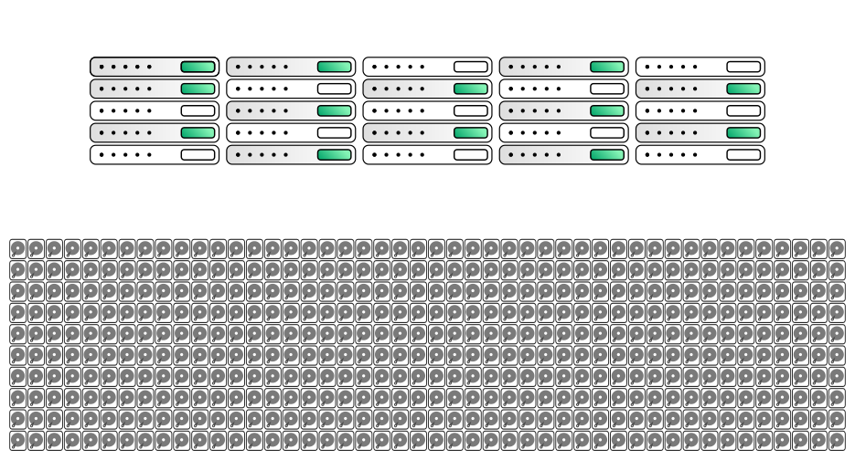
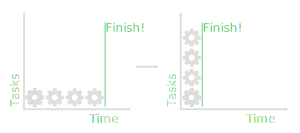

<!-- .slide: data-background="assets/img/rse-logo.svg" -->
<!-- .slide: data-background-opacity="0.2" -->
# Reproducibility on the HPC

## Twin Karmakharm

---
<!-- .slide: data-background="assets/img/rse-logo.svg" -->
<!-- .slide: data-background-opacity="0.2" -->

### Research Software Engineering Sheffield

* Increasing research impact through software
* Support and consultancy in research software and systems development and maintenance
    * Grant support
* Software optimisation, GPU and HPC
* Training, outreach and education activities
* Led by Dr. Paul Richmond
* Visit us at [https://rse.shef.ac.uk](https://rse.shef.ac.uk)

---

## Contents

* High Performance Computing Overview
* Reproducibility on the HPC
* Reproducibility best practices


---

## High Performance Computing Overview

---

### What is HPC?

High Performance Computing (HPC) refers to a network (cluster) of connected computers (nodes).

---

### HPC Hardware: Desktop and HPC Node comparison

It's like your PC but bigger!

<object type="image/svg+xml" data="assets/img/desktop-hpc.svg" style="height: auto;">
<param id="layer2" class="fragment" />
<param id="layer3" class="fragment" />
<param id="layer4" class="fragment" />
</object>

---

### HPC Hardware: An example HPC cluster

<object type="image/svg+xml" data="assets/img/hpc-overview.svg" style="width: 70%;height: auto;">
<param id="layer2" class="fragment fade-in-then-out" data-fragment-index="1"/>
<param id="layer3" class="fragment fade-in-then-out" data-fragment-index="2"/>
<param id="layer4" class="fragment fade-in-then-out" data-fragment-index="3"/>
<param id="layer5" class="fragment fade-in-then-out" data-fragment-index="4"/>
<param id="layer6" class="fragment fade-in-then-out" data-fragment-index="5"/>
</object>

---

### HPC Software

* Majority runs on a distribution of Linux <!-- .element: class="fragment" data-fragment-index="1" -->
* Command Line interface (GUI available on some programs e.g. Matlab) <!-- .element: class="fragment" data-fragment-index="2" -->
* Has a job scheduler to enforce fair usage <!-- .element: class="fragment" data-fragment-index="3" -->

<object type="image/svg+xml" data="assets/img/hpc-software.svg" style="width: 70%;height: auto;">
<param id="layer1" class="fragment" data-fragment-index="1"/>
<param id="layer2" class="fragment" data-fragment-index="2"/>
<param id="layer3" class="fragment" data-fragment-index="3"/>
</object>


---
### HPC Scheduler: Submitting a job

You can run code interactively (using `srun` on SLURM) when:
* Installing software
* Testing/developing your code

But for long-running tasks, you'll need to submit a job.

---

### HPC Scheduler: Submitting a job

<object type="image/svg+xml" data="assets/img/scheduler-cycle.svg" style="width: 70%;height: auto;">
<param id="layer2" class="fragment" />
<param id="layer3" class="fragment" />
<param id="layer4" class="fragment" />
<param id="layer5" class="fragment" />
</object>

---

## Reproducibility on the HPC

---

### How to HPC reprohack


<object type="image/svg+xml" data="assets/img/repro-components.svg" style="width: 70%;height: auto;">
<param id="layer2" class="fragment" />
<param id="layer3" class="fragment" />
<param id="layer4" class="fragment" />
<param id="layer5" class="fragment" />
</object>

---

### How to HPC reprohack

In reality:

<object type="image/svg+xml" data="assets/img/repro-components-questions.svg" style="width: 70%;height: auto;">
</object>

---

### Paper

Any suggestions on what to put here?

---

### Data

---

### Getting the Data

Go to your home directory 
```bash
cd ~
```

Download your data

```bash
# If it's in a git repo
git clone https://github.com/username/reponame.git
# If it's a download link
wget https://server.com/thedata 
```

Or download locally and scp to server, adding ssh settings to .ssh/config allows you to do this:

```bash
scp mydata/path hpcname:~/
```

---

### Getting the Data

Unzip/untar your data

```bash
tar -xvf filename.tar
tar -xvzf filename.tar.gz
unzip filename.zip # You might need to load/install the unzip module
```

Now the data's on the network HDD

---

### Where should I put the data?

From fastest to slowest:

RAM > Local SSD > Network SSD > Network HDD

If the dataset is small enough then load it all to memory. 

---

### Where should I put the data?

Local SSD (`/tmp`, `/scratch`, etc.) may seem like a good compromise, but they are non-persistent. 

There's an initial cost to copying the dataset from Network storage.

Use them for intermediate results that you intend to throw away.

---

### Software

* Paper uses an existing software package
* Paper provide their own code

---

### Software packages

What packages are used in the submissions:
* LAMMPS, GROMACS, SimpleMD, PLUMED
* OpenFoam + Plugin
* Matlab
* Quantum espresso

---

### Software packages

* Get your IT dept or RSEs to install them for you!
  * Some require compilation with architecture optimisation
  * Issue with interconnect interoperability e.g. using MPI on infiniband
  * Integration with maths library like MKL


---

### Software as code: Languages survey

* What languages did the submissions use?
  * C++
  * Fortran
  * Python
    * Scipy
    * pytorch
  * Julia
* What about build tools?
  * Make & Cmake

---

### Building software on the HPC

Building software on the HPC is <strong><u>easy</u></strong>!

<div class="fragment">
It's building all the <strong><u>dependencies</u></strong> that's the hard part.
</div>
 

---

### Building software on the HPC

You're not an admin on the HPC, it's not possible to use `sudo`

<div class="fragment">

This rules out standard package managers like `apt` or `yum`

</div>


So what are the alternatives? <!-- .element class="fragment" -->

---

### HPC specific package managers

* [conda](https://docs.conda.io/en/latest/)
  * Pre-built packages for Pythons, R, etc.
  * If you're using Python or R, try conda first
* [spack](https://spack.readthedocs.io/en/latest/)
  * Works similarly to `apt` or `yum`, mainly for C/C++ libraries
  * Optimised for HPCs, software is built locally and optimised to hardware

---

### Containers and HPC

<div style="display: flex">
<div style="flex: 1">
Virtual machines


</div>
<div style="flex: 1">
Containers


</div>

</div>

---

<!-- .slide: data-background="assets/img/containers.jpg" -->
<!-- .slide: data-background-opacity="0.1" -->
### Containers and HPC


* A way to package your software and all its dependencies in a self-contained unit (image)
* Containers requires less resource to run and are faster to launch than virtual machines (VMs) as it does not emulate the entire operating system
* Possible to package data, and even entire workflows within the image
* Possible to archive the entire image
* Open MPI with infiniband, check with your local RSE

---

<!-- .slide: data-background="assets/img/singularity-logo.png" -->
<!-- .slide: data-background-opacity="0.1" -->
### Containers and HPC


* [Singularity](https://sylabs.io/docs/) (Now [apptainer](https://apptainer.org/))
  * Designed specifically to for the HPC, does not need administrator rights to **`run`**
  * Still need administrator rights to build images
  * Only runs on Linux (can run within a Linux VM or Windows Subsystem for Linux v2)

---
<!-- .slide: data-background="assets/img/docker-logo.png" -->
<!-- .slide: data-background-opacity="0.1" -->

### Containers and HPC


* [Docker](https://www.docker.com/)
  * Used mostly in Enterprise where it's normal to own an entire (virtual) machine
  * Needs administrator rights to build **and** run
    * However, Singularity can be used to run docker images!
  * Runs on Windows, mac and Linux

---

<!-- .slide: data-background="./assets/img/carbus.svg" -->
<!-- .slide: data-background-opacity="0.5" -->

### HPC Workflow

* It can take time for your queued jobs to run
* A node can be used by multiple users at the same time 
* Individual CPU cores on HPC may be slower than your machine
* Network storage is slower than SSD

---

<!-- .slide: data-background="./assets/img/busfleet.svg" -->
<!-- .slide: data-background-opacity="0.5" -->

### HPC Workflow: You need to parallelise!


Take advantage of the fact that there's a lot of CPUs and Nodes:




---
<!-- .slide: data-background="./media/img/busfleet.svg" -->
<!-- .slide: data-background-opacity="0.1" -->

### HPC Workflow: You need to parallelise!
Break down your problem into small tasks and run them concurrently:





---
<!-- .slide: data-background="./assets/img/busfleet.svg" -->
<!-- .slide: data-background-opacity="0.1" -->

### You need to parallelise!
Break down your problem into small tasks and run them concurrently:

* Multiple independent jobs can be submitted at the same time
  * Schedulers have support for submitting an 'array' of jobs (task arrays/job arrays)
* Manage parallisation in your code using:
  * Accelerators e.g. GPUs: CUDA, OpenCL 
  * Single node (multiple CPUs): Threads, MKL, OpenMP 
  * Between nodes: Message Passing Interface (MPI)
* Many scientific software has parallelisation support either built-in or through plugins

---

<!-- .slide: data-background="./assets/img/parallel.svg" -->
<!-- .slide: data-background-opacity="0.1" -->


### Scheduler: Submit your jobs

* Running things 'live' in an interactive session is great for testing things out and running small tasks
	* ... but you're time-limited to a few hours
* It can be difficult to get interactive sessions on popular resources e.g. GPUs
* So create a job script and submit your job to the queue!
	* It's possible to submit multiple jobs have have them run concurrently!
	* Look into using **task arrays** i.e. submiting multiple jobs from a single script


---


### Scheduler: Request only what you need

More resource requested means it's harder for the scheduler to find a slot for your job.

**Always set your job execution-time!**

| | SLURM  |
|--			|--|
| Execution-time |  `-t [mins]` <br> `-t [days-hh:mm:ss]`  |
| Memory 		| `-mem-per-cpu=3850`|
| No. CPU cores  | `--cpus-per-task=1` |
| GPUs | `--gres=gpu:ampere_a100:1` |

---

## Reproducibility best practices

* Version Control Your Code and Data
  * Git, Github for code
  * Git LFS, DCV for data
  
---

## Reproducibility best practices

* Document your code and data
  * Provide a `readme.md` at the root of your project/data folder
    * Project/data description
    * Dependencies
    * File/directory structure
    * Build instructions
    * Run instructions
  
---

## Reproducibility best practices

* Show your workings
  * Jupyter notebooks, RMarkdown, etc. provide a way to combine text and code to show your scientific process

---

## Conclusion


