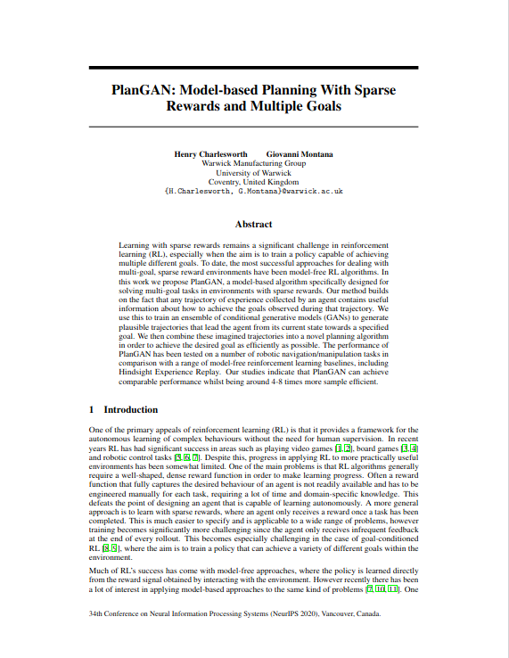
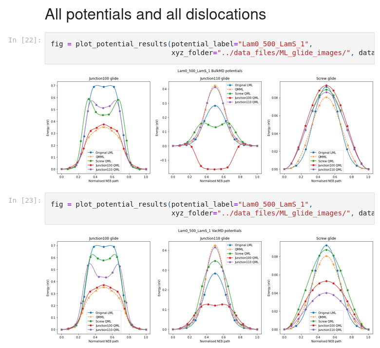

<!-- .slide: data-background="assets/img/rse-logo.svg" -->
<!-- .slide: data-background-opacity="0.2" -->
# Reproducibility on the HPC

## Twin Karmakharm

---
<!-- .slide: data-background="assets/img/rse-logo.svg" -->
<!-- .slide: data-background-opacity="0.2" -->

### Research Software Engineering Sheffield

* Increasing research impact through software
* Support and consultancy in research software and systems development and maintenance
    * Grant support
* Software optimisation, GPU and HPC
* Training, outreach and education activities
* Led by Dr. Paul Richmond
* Visit us at [https://rse.shef.ac.uk](https://rse.shef.ac.uk)

---

## Contents

* High Performance Computing Overview
* Reproducibility on the HPC
* Reproducibility best practices


---

## High Performance Computing Overview

---

### What is HPC?

High Performance Computing (HPC) refers to a network (cluster) of connected computers (nodes).

---

### HPC Hardware: Desktop and HPC Node comparison

It's like your PC but bigger!

<object type="image/svg+xml" data="assets/img/desktop-hpc.svg" style="height: auto;">
<param id="layer2" class="fragment" />
<param id="layer3" class="fragment" />
<param id="layer4" class="fragment" />
</object>

---

### HPC Hardware: An example HPC cluster

<object type="image/svg+xml" data="assets/img/hpc-overview.svg" style="width: 70%;height: auto;">
<param id="layer2" class="fragment fade-in-then-out" data-fragment-index="1"/>
<param id="layer3" class="fragment fade-in-then-out" data-fragment-index="2"/>
<param id="layer4" class="fragment fade-in-then-out" data-fragment-index="3"/>
<param id="layer5" class="fragment fade-in-then-out" data-fragment-index="4"/>
<param id="layer6" class="fragment fade-in-then-out" data-fragment-index="5"/>
</object>

---

### HPC Software

* Majority runs on a distribution of Linux <!-- .element: class="fragment" data-fragment-index="1" -->
* Command Line interface (GUI available on some programs e.g. Matlab) <!-- .element: class="fragment" data-fragment-index="2" -->
* Has a job scheduler to enforce fair usage <!-- .element: class="fragment" data-fragment-index="3" -->

<object type="image/svg+xml" data="assets/img/hpc-software.svg" style="width: 70%;height: auto;">
<param id="layer1" class="fragment" data-fragment-index="1"/>
<param id="layer2" class="fragment" data-fragment-index="2"/>
<param id="layer3" class="fragment" data-fragment-index="3"/>
</object>


---
### HPC Scheduler: Submitting a job

You can run code interactively (using `srun` on SLURM) when:
* Installing software
* Testing/developing your code

But for long-running tasks, you'll need to submit a job.

---

### HPC Scheduler: Submitting a job

<object type="image/svg+xml" data="assets/img/scheduler-cycle.svg" style="width: 70%;height: auto;">
<param id="layer2" class="fragment" />
<param id="layer3" class="fragment" />
<param id="layer4" class="fragment" />
<param id="layer5" class="fragment" />
</object>

---

## Reproducibility on the HPC

---

### How to HPC reprohack


<object type="image/svg+xml" data="assets/img/repro-components.svg" style="width: 70%;height: auto;">
<param id="layer2" class="fragment" />
<param id="layer3" class="fragment" />
<param id="layer4" class="fragment" />
<param id="layer5" class="fragment" />
</object>

---

### How to HPC reprohack

In reality:

<object type="image/svg+xml" data="assets/img/repro-components-questions.svg" style="width: 70%;height: auto;">
</object>

---

### Paper

<div style="display: flex">
<div>

* What are we trying to reproduce?
  * Expected results
  * Expected performance 
  * Expected time to complete
* Workflow outline
  * Pre/post processing steps
  * Parameters
  * Software
  * Dataset

</div>
<div>



</div>
</div>


---

### Data

---

### Getting the Data

Go to your home directory 
```bash
cd ~
```

Download your data

```bash
# If it's in a git repo
git clone https://github.com/username/reponame.git
# If it's a download link
wget https://server.com/thedata 
```

Or download locally and scp to server, adding ssh settings to .ssh/config allows you to do this:

```bash
# Run this command from your local machine
scp mydata/path hpcname:~/
```

---

### Getting the Data

Unzip/untar your data

```bash
tar -xvf filename.tar
tar -xvzf filename.tar.gz
unzip filename.zip # You might need to load/install the unzip module
```

Now the data's on the network HDD

---

### Where should I put the data?

From fastest to slowest:

RAM > Local SSD > Network SSD > Network HDD

If the dataset is small enough then load it all to memory. 

---

### Where should I put the data?

Local SSD (`/tmp`, `/scratch`, etc.) may seem like a good compromise, but they are non-persistent. 

There's an initial cost to copying the dataset from Network storage.

Use them for intermediate results that you intend to throw away.

---

### Software

* Paper uses an existing software package
* Paper provide their own code

---

### Software packages

What packages are used in the submissions:
* LAMMPS, GROMACS, SimpleMD, PLUMED
* OpenFoam + Plugin
* Matlab
* Quantum espresso

---

### Software packages

* Get your IT dept or RSEs to install them for you!
  * Some require compilation with architecture optimisation
  * Issue with interconnect interoperability e.g. using MPI on infiniband
  * Integration with maths library like MKL


---

### Software packages

HPCs use `modules` system to load software:

```bash
# Check for existing software/libraries
$ module avail

amber/20                       gromacs/2021.2         plumed/2.6.2
autodock-gpu/1.5.2             gromacs/2021.5         pytorch/1.9.0
emacs/27.1                     gromacs/2022    (D)    sox/14.4.2
ffmpeg/4.2.2                   mdtraj/1.9.5           tensorflow/2.3.1
gnuplot/5.2.8                  namd/2.14              tensorflow/2.7.0 (D)
gromacs/2020.3                 namd/3.0-alpha7 (D)    tmux/3.2a        (D)
gromacs/2020.4-plumed-2.6.2    nano/5.3               vim/8.2
gromacs/2020.5-ramd-2.0        opencv/4.2.0
gromacs/2021.1                 openmm/7.5.0

```

---

### Software packages

HPCs use `modules` system to load software:

```bash
# Load the software you want from the list 
$ module load gromacs/2022

# There's a default library (D) that gets loaded when
# you don't specify a version, code below will also 
# load gromacs 2022
$ module load gromacs


# Run gromacs...
$ gmx ...
```

---

### Software as code: Languages survey

* What languages did the submissions use?
  * C++
  * Fortran
  * Python
    * Scipy
    * pytorch
  * Julia
* What about build tools?
  * Make & Cmake

---

### Building software on the HPC

Building software on the HPC is <strong><u>easy</u></strong>!

```bash
# Load your build tools and compilers
# (module names are different on every HPC) 
$ module load libraries/g++ cmake

# Build your software
$ ./configure
$ make
```

---

### Building software on the HPC: Dependencies

It's building all the <strong><u>dependencies</u></strong> that's the hard part.

---

### Building software on the HPC: Dependencies

e.g. here's a dependency tree for Tensorflow 2
```
tensorflow-gpu==2.1.0
  - absl-py [required: >=0.7.0, installed: 0.9.0]
    - six [required: Any, installed: 1.14.0]
  - astor [required: >=0.6.0, installed: 0.8.1]
  - gast [required: ==0.2.2, installed: 0.2.2]
  - google-pasta [required: >=0.1.6, installed: 0.2.0]
    - six [required: Any, installed: 1.14.0]
  - grpcio [required: >=1.8.6, installed: 1.28.1]
    - six [required: >=1.5.2, installed: 1.14.0]
  - keras-applications [required: >=1.0.8, installed: 1.0.8]
    - h5py [required: Any, installed: 2.10.0]
      - numpy [required: >=1.7, installed: 1.18.2]
      - six [required: Any, installed: 1.14.0]
    - numpy [required: >=1.9.1, installed: 1.18.2]
  - keras-preprocessing [required: >=1.1.0, installed: 1.1.0]
    - numpy [required: >=1.9.1, installed: 1.18.2]
    - six [required: >=1.9.0, installed: 1.14.0]
  - numpy [required: >=1.16.0,<2.0, installed: 1.18.2]
  - opt-einsum [required: >=2.3.2, installed: 3.2.0]
    - numpy [required: >=1.7, installed: 1.18.2]
  - protobuf [required: >=3.8.0, installed: 3.11.3]
    - setuptools [required: Any, installed: 45.2.0.post20200210]
    - six [required: >=1.9, installed: 1.14.0]
  - scipy [required: ==1.4.1, installed: 1.4.1]
    - numpy [required: >=1.13.3, installed: 1.18.2]
  - six [required: >=1.12.0, installed: 1.14.0]
  - tensorboard [required: >=2.1.0,<2.2.0, installed: 2.1.1]
    - absl-py [required: >=0.4, installed: 0.9.0]
      - six [required: Any, installed: 1.14.0]
    - google-auth [required: >=1.6.3,<2, installed: 1.13.1]
      - cachetools [required: >=2.0.0,<5.0, installed: 4.0.0]
      - pyasn1-modules [required: >=0.2.1, installed: 0.2.8]
        - pyasn1 [required: >=0.4.6,<0.5.0, installed: 0.4.8]
      - rsa [required: >=3.1.4,<4.1, installed: 4.0]
        - pyasn1 [required: >=0.1.3, installed: 0.4.8]
      - setuptools [required: >=40.3.0, installed: 45.2.0.post20200210]
      - six [required: >=1.9.0, installed: 1.14.0]
    - google-auth-oauthlib [required: >=0.4.1,<0.5, installed: 0.4.1]
      - google-auth [required: Any, installed: 1.13.1]
        - cachetools [required: >=2.0.0,<5.0, installed: 4.0.0]
        - pyasn1-modules [required: >=0.2.1, installed: 0.2.8]
          - pyasn1 [required: >=0.4.6,<0.5.0, installed: 0.4.8]
        - rsa [required: >=3.1.4,<4.1, installed: 4.0]
          - pyasn1 [required: >=0.1.3, installed: 0.4.8]
        - setuptools [required: >=40.3.0, installed: 45.2.0.post20200210]
        - six [required: >=1.9.0, installed: 1.14.0]
      - requests-oauthlib [required: >=0.7.0, installed: 1.3.0]
        - oauthlib [required: >=3.0.0, installed: 3.1.0]
        - requests [required: >=2.0.0, installed: 2.22.0]
          - certifi [required: >=2017.4.17, installed: 2019.11.28]
          - chardet [required: >=3.0.2,<3.1.0, installed: 3.0.4]
          - idna [required: >=2.5,<2.9, installed: 2.8]
          - urllib3 [required: >=1.21.1,<1.26,!=1.25.1,!=1.25.0, installed: 1.25.7]
    - grpcio [required: >=1.24.3, installed: 1.28.1]
      - six [required: >=1.5.2, installed: 1.14.0]
    - markdown [required: >=2.6.8, installed: 3.2.1]
      - setuptools [required: >=36, installed: 45.2.0.post20200210]
    - numpy [required: >=1.12.0, installed: 1.18.2]
    - protobuf [required: >=3.6.0, installed: 3.11.3]
      - setuptools [required: Any, installed: 45.2.0.post20200210]
      - six [required: >=1.9, installed: 1.14.0]
    - requests [required: >=2.21.0,<3, installed: 2.22.0]
      - certifi [required: >=2017.4.17, installed: 2019.11.28]
      - chardet [required: >=3.0.2,<3.1.0, installed: 3.0.4]
      - idna [required: >=2.5,<2.9, installed: 2.8]
      - urllib3 [required: >=1.21.1,<1.26,!=1.25.1,!=1.25.0, installed: 1.25.7]
    - setuptools [required: >=41.0.0, installed: 45.2.0.post20200210]
    - six [required: >=1.10.0, installed: 1.14.0]
    - werkzeug [required: >=0.11.15, installed: 0.15.4]
    - wheel [required: >=0.26, installed: 0.34.2]
```

---

### Building software on the HPC: Dependencies

You'll probably find that you're missing some dependencies... Fortran? Boost? OpenBLAS? OpenCV? CUDA libs? etc. <!-- .element class="fragment" -->

You might also run into problems installing the dependencies... incompatible glibc version, library conflicts, etc. <!-- .element class="fragment" -->

---


### Building software on the HPC

You're not an admin on the HPC, it's not possible to use `sudo`

<div class="fragment">

This rules out standard package managers like `apt` or `yum`

</div>


So what are the alternatives? <!-- .element class="fragment" -->

---

### HPC specific package managers

* [conda (https://docs.conda.io)](https://docs.conda.io/en/latest/)
  * Pre-built packages for Pythons, R, etc.
  * If you're using Python or R, try conda first
* [spack (https://spack.readthedocs.io)](https://spack.readthedocs.io/en/latest/)
  * Works similarly to `apt` or `yum`, mainly for C/C++ libraries
  * Optimised for HPCs, software is built locally and optimised to hardware
  
---

### HPC specific package managers

* Packages are built and installed entirely in you home directory
* They can create virtual environments
  * Easy to switch an entire set of installed software
  * Provide a way to share list of installed software in each environment
    * python virtualenv - `requirements.txt`    
    * Conda - `environment.yml`
    * Spack - `spack.yml` & `spack.lock`

---

<!-- .slide: data-background="assets/img/containers.jpg" -->
<!-- .slide: data-background-opacity="0.1" -->
### Containers and HPC

<div style="display: flex">
<div style="flex: 1">
Virtual machines


</div>
<div style="flex: 1">
Containers


</div>

</div>

---

<!-- .slide: data-background="assets/img/containers.jpg" -->
<!-- .slide: data-background-opacity="0.1" -->
### Containers and HPC


* A way to package your software and all its dependencies in a self-contained unit (image)
* Containers requires less resource to run and are faster to launch than virtual machines (VMs) as it does not emulate the entire operating system
* Possible to package data, and even entire workflows within the image
* Possible to archive the entire image
* OpenMPI with infiniband needs extra drivers, check with your local RSE

---

<!-- .slide: data-background="assets/img/singularity-logo.png" -->
<!-- .slide: data-background-opacity="0.1" -->
### Containers and HPC


* [Singularity](https://sylabs.io/docs/) (Now [apptainer](https://apptainer.org/))
  * Designed specifically to for the HPC, does not need administrator rights to **`run`**
  * Still need administrator rights to build images
  * Only runs on Linux (can run within a Linux VM or Windows Subsystem for Linux v2)

---
<!-- .slide: data-background="assets/img/docker-logo.png" -->
<!-- .slide: data-background-opacity="0.1" -->

### Containers and HPC


* [Docker](https://www.docker.com/)
  * Used mostly in Enterprise where it's normal to own an entire (virtual) machine
  * Needs administrator rights to build **and** run
    * However, Singularity can be used to run docker images!
  * Runs on Windows, mac and Linux

---

<!-- .slide: data-background="./assets/img/carbus.svg" -->
<!-- .slide: data-background-opacity="0.5" -->

### HPC Workflow

* Why are things running slower than my desktop?
  * It can take time for your queued jobs to run
  * A node can be used by multiple users at the same time 
  * Individual CPU cores on HPC may be slower than your machine
  * Network storage is slower than SSD

---

<!-- .slide: data-background="./assets/img/busfleet.svg" -->
<!-- .slide: data-background-opacity="0.5" -->

### HPC Workflow: You need to parallelise!


Take advantage of the fact that there's a lot of CPUs and Nodes:


---
<!-- .slide: data-background="./media/img/busfleet.svg" -->
<!-- .slide: data-background-opacity="0.1" -->

### HPC Workflow: You need to parallelise!
Break down your problem into small tasks and run them concurrently:


---
<!-- .slide: data-background="./assets/img/busfleet.svg" -->
<!-- .slide: data-background-opacity="0.1" -->

### You need to parallelise!
Break down your problem into small tasks and run them concurrently:

* Multiple independent jobs can be submitted at the same time
  * Schedulers have support for submitting an 'array' of jobs (task arrays/job arrays)
* Manage parallisation in your code using:
  * Accelerators e.g. GPUs: CUDA, OpenCL 
  * Single node (multiple CPUs): Threads, MKL, OpenMP 
  * Between nodes: Message Passing Interface (MPI)
* Many scientific software has parallelisation support either built-in or through plugins

---

<!-- .slide: data-background="./assets/img/parallel.svg" -->
<!-- .slide: data-background-opacity="0.1" -->


### Scheduler: Submit your jobs

* Running things 'live' in an interactive session is great for testing things out and running small tasks
	* ... but you're time-limited to a few hours
* It can be difficult to get interactive sessions on popular resources e.g. GPUs
* So create a job script and submit your job to the queue!
	* It's possible to submit multiple jobs have have them run concurrently!
	* Look into using **task arrays** i.e. submiting multiple jobs from a single script


---


### Scheduler: Request only what you need

More resource requested means it's harder for the scheduler to find a slot for your job.

**Always set your job execution-time!**

| | SLURM  |
|--			|--|
| Execution-time |  `-t [mins]` <br> `-t [days-hh:mm:ss]`  |
| Memory 		| `-mem-per-cpu=3850`|
| No. CPU cores  | `--cpus-per-task=1` |
| GPUs | `--gres=gpu:ampere_a100:1` |

---

## Reproducibility best practices

---

### Reproducibility best practices

* Version control your code and data
  * Git with Github, Gitlab, Bitbucket, etc. for code
  * Git, Git LFS, DCV, etc. for data
  
---

### Reproducibility best practices

* Document your code and data
  * Provide a `readme.md` at the root of your project/data folder
    * Project/data description
    * Dependencies
    * File/directory structure
    * Build instructions
    * Run instructions

---

### Reproducibility best practices

<div style="display: flex">

<div>

* Show your workings
  * Jupyter notebooks, RMarkdown, etc. provide a way to combine text and code to show your scientific process
  
</div>
<div>

</div>
</div>

---

<!-- .slide: data-background="assets/img/rse-logo.svg" -->
<!-- .slide: data-background-opacity="0.1" -->

## Conclusion

* You need to parallelise your tasks to take advantage of HPC
* Use package mangers or containers when you can
* Submit jobs, request only the resources you need
* Follow reproducibility best practices in your own research:
  * Use version control  
  * Document your code and data
  * Show your workings
  * Try to do this from the start of the research!

---
<!-- .slide: data-background="assets/img/rse-logo.svg" -->
<!-- .slide: data-background-opacity="0.1" -->

## Thanks for listening!

